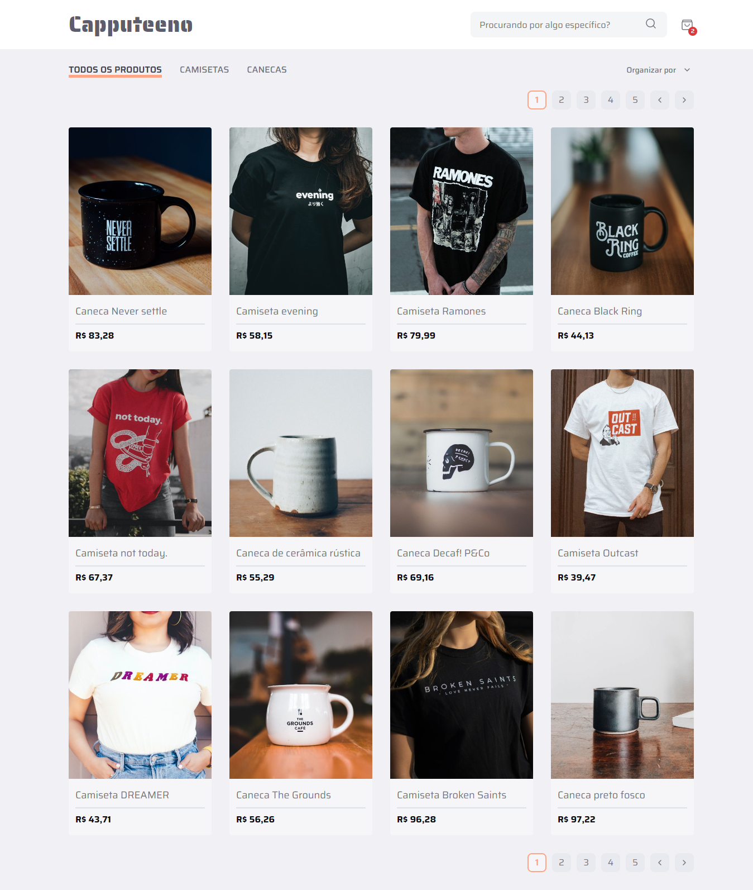

# Capputeeno

Bem-vindo! Este repositório contém minha solução para o Desafio Frontend de código aberto da [Rocketseat´s](https://www.rocketseat.com.br/ignite?utm_source=influencer&utm_medium=publipost&utm_campaign=lead&utm_term=ignite&utm_content=lead-ignite-publipost-organic-cupom_KIPPERDEV-none-none-none-none-redes_kipperdev&referral=kipperdev&coupon=KIPPERDEV@IGNITE) [Frontend Challenge](https://github.com/Rocketseat/frontend-challenge).



## 🧠 Sobre o Projeto

Este projeto foi desenvolvido com o objetivo de aprender e aprimorar meu conhecimento em desenvolvimento web. Lidando tanto com tecnologias que já estou familiarizado tanto com algumas que eu nunca tinha me aprofundado.

O desafio consiste em implementar um e-commerce para a venda de canecas e camisetas, com as seguintes funcionalidades:

- [x] Catálogo de produtos com paginação
- [x] Filtar produtos por categoria
- [x] Pesquisar por nome de produto
- [x] Adicionar e remover produtos do carrinho
- [x] Página de checkout

## 📋 Requisitos

- Siga [este protótipo](https://www.figma.com/file/rET9F2CeUEJdiVN7JRu993/E-commerce---capputeeno?node-id=680%3A6449)
- Utilize Next.js e Typescript
- Crie componentes com styled-components
- Consuma a **API GraphQL** fornecida

## 🖥️ Instalação

### Frontend

1. Clone este repositório
```bash
git clone https://github.com/gabrielzinx/challenge-frontend.git
```

2. Acesse a pasta do projeto
```bash
cd challenge-frontend
cd capputeeno
```

3. Instale as dependências
```bash
npm install
```

4. Execute o Frontend
```bash
npm run dev
```

### Executando a API

1. Acesse a pasta da API
```bash
cd challenge-frontend
cd api
```

2. Instale as dependências
```bash
npm install
```

3. Inicie a API
```bash
npm start
```

## 🌐 Acesso à Aplicação

Após seguir as etapas de instalação, você poderá acessar a aplicação no seu navegador em `http://localhost:3000`.

## 🛠️ Tecnologias Utilizadas

Neste projeto, utilizei as seguintes tecnologias:

- [Next.js](https://nextjs.org/) - Um framework React para desenvolvimento web.
- [Typescript](https://www.typescriptlang.org/) - Uma linguagem de programação tipada.
- [CSS Modules](https://nextjs.org/docs/app/building-your-application/styling/css-modules) - Next.js tem suporte integrado para módulos CSS.
- [GraphQL](https://graphql.org/) - Uma linguagem de consulta para APIs.

## 📬 Contato

Se você tiver alguma dúvida ou quiser entrar em contato, sinta-se à vontade para me enviar uma mensagem por meio do meu perfil no GitHub ou pelo meu email: [gabriel.soaressc58@gmail.com](mailto:gabriel.soaressc58@gmail.com).

Espero que este README tenha sido útil em mostrar a minha solução do desafio frontend.